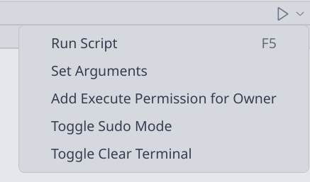

# Shell Runner

Shell Runner is a user-friendly VS Code extension for running shell scripts directly from the editor. It provides one-click execution, argument input with history, sudo support, and executable permission management.

## Features

- **One-click Run**: Instantly run the current shell script from the editor title bar.
- **Auto Save**: Automatically saves the file before execution to ensure the latest content is run.
- **Argument Input & History**: Enter arguments for your script. Shell Runner will remember the most recent arguments for up to 6 recently used files.
- **Run as Sudo**: Optionally run scripts with root privileges.
- **Executable Permission Management**: Add execute permission for the current user (owner +x) with a single click.
- **Terminal Reuse**: Reuses the terminal for repeated runs of the same script.
- **Clear Terminal Option**: Optionally clear the terminal before each run.

## Usage

1. Open any shell script file (e.g., `.sh`, `.bash`, `.zsh`, `.fish`).
2. Click the "Run" button in the editor title bar to execute the script.
3. Use the argument button to input or edit script arguments.
4. Toggle the sudo button to run as root if needed.
5. If the script is not executable, click the "owner +x" button to add execute permission for the current user.

## Screenshots

## Requirements

- Linux (shell execution support required). Windows is not supported.
- VS Code version 1.74.0 or higher.

## Extension Settings

No additional configuration is required for this version.

## Release Notes

### 1.0.0

- Initial release with one-click run, argument input/history, sudo, and executable permission management.
